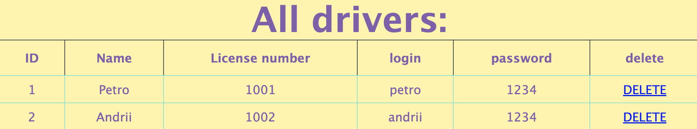

<h1 align="center"> Taxi-Service </h1> <br>

<p align="center">
The program allows you to view, configure and change liststaxi fleet only to registered driver users.
</p>

```
note: a driver are a user. Thanks to which drivers can use the program
```


## Table of Contents

- [A more detailed description of the functionality](#functionality)
- [Project structure](#project-structure)
- [Technologies used](#technologies-used)
- [Instructions for launching the project](#instructions)
---

## functionality

#### Login :
The taxi service program welcomes us to the main authorization page. Where does registration and entry into the service table take place.
 - [view the structure of the 'login' page](#login-page)


#### _Add driver_ :
In the event that the user is not registered, we can add him thanks to the 'Add driver'  button, which allows you to create a new driver-user and add him to the taxi fleet database.
 - [view the structure of the 'Add driver' page](#add-driver)


#### _Taxi service_ :
If the password and login are in our database, we get to the "Taxi Service" page. This menu consists of 8 items. Seven fields are responsible for links to menus and tables and one "current driver" button, which shows all the cars of the user who is authorized and is in the "Taxi Service" menu.


```
1. The 'Display All Drivers' link moves to 'All Drivers', which contains all the drivers listed in the taxi fleet.
```
 - [view the structure of the 'All Drivers' page](#all-drivers)



```
2. The 'Display All Cars' link moves to 'All cars', which contains all the cars listed in the taxi fleet
```
 - [view the structure of the 'All Cars' page](#all-drivers)


```
3. The 'Display All Manufacturers' link takes you to the 'All manufacturers:' table, which contains all the manufacturers listed in the taxi fleet
```
 - [view the structure of the 'All manufacturers' page](#all-manufacturers)


```
4. The 'Create new Driver' link moved to the page from the 'Add driver' menu allows you to create a new user driver and enter it into the taxi fleet database.
```
 - [view the structure of the 'Add driver' page](#add-driver)


```
5. The 'Create new Car' link takes you to the page from the 'Add car' menu, to create a new car and enter it into our database
```
 - [view the structure of the 'Add car' page](#add-car)


```
6. The 'Create new Manufacturer' link moved to the page from the 'Add manufacturer' menu allows you to create a new machine manufacturer and enter it into our database
```
 - [view the structure of the 'Add car' page](#add-manufacturer)


```
7. The 'Add Driver to Car' link takes you to the page from the 'Add driver to car' menu, allows you to attach a driver to the car
```
 - [view the structure of the 'Add driver to car' page](#add-driver-to-car)


```
8. the 'current driver' button, this button is the last in the 'Taxi service' menu and displays all the cars of the logged-in user in this menu. When clicked, it opens the "All cars" table, but the filter displays only the cars of the logged-in user
```
 - [view the structure of the 'Add driver to car' page](#all-cars-current)


---

## project-structure

##### login-page 

1. 'Please enter your login:' - enter the driver's login
2. 'Please enter your password:' - enter the driver's password
3. button 'login' - allows you to log in and go to the 'Taxi service' page where we can manage our taxi fleet.

```
note: If the user is registered, we will get to the 'Taxi service' menu,
if not, then the name "Username or password was incorrect" will appear, indicating that such a user is not in our database
```
		
4. the 'add new driver' button - allows you to create a new driver-user, after clicking it will take us to the 'Add driver' page, where we register a new driver-user.

##### add-driver

1. In the 'Name' field - enter the name of the driver-user
2. In the 'License number' field - enter the personal driver's license number
3. In the 'login' field - enter the driver's login
4. In the 'password' - enter the driver's password
5. Then you need to press the button
"Add" which comes immediately after all filled fields.
The new user will be saved to our database 

##### all-drivers

1. ID ~ Driver's personal ID
2. Name ~ Driver's name
3. License number ~ Personal license number of the driver 
4. login ~ Driver login
5. password ~ Driver password
6. delete ~ Allows you to remove a driver from the taxi service

##### all-manufacturers
1. ID ~ Personal ID of the car manufacturer
2. Name ~ Name of the car manufacturer
3. Country ~ Indicates the country of origin of the manufacturer
4. Delete ~ Allows you to remove the manufacturer in the taxi service

##### add-car
1. In the 'Model' field - enter the car model
2. In the 'Manufacturer ID' field - enter the manufacturer's ID number, which is in the "All manufacturers" table
```
in 'All manufacturers' in the 'ID' column this is necessary so that the program can find the manufacturer of our car
``` 
3. then you need to press the "Add" button, which comes immediately after all filled-in fields. The new car will be saved to our base 

##### add-manufacturer
1. In the 'Name' field - enter the name of the car manufacture
2. In the 'Country' field - enter the country of manufacture
3. then you need to press the "Add" button, which comes immediately after all filled-in fields. The new manufacturer will be saved in our database 

##### add-driver-to-car
1. In the 'Car ID' field - enter the machine ID
```
the car ID is in the 'All cars' table in the 'ID' column
```
2. In the 'Driver ID' field - enter the driver's ID
```
the driver ID is in the 'All Drivers' table in the 'ID' column
```
3. then you need to press the "Add" button, which comes immediately after all filled-in fields. The driver selected by ID will be added to the car selected by ID

##### all-cars-current
1. ID ~ Personal vehicle ID
2. Manufacturer name ~ Name of the car manufacturer
3. Manufacturer country ~ Indicates the country of origin of the manufacturer
4. Drivers ~ this column shows the drivers registered for this car
```
column 'Drivers' contains 3 values from the table
  'All Drivers', a namely: 'ID', 'Name', 'License number'
```
6. delete ~ allows you to remove the car from the taxi service
---
## technologies-used
##### in this project such tools were used as:

	java 11
	servlet API
	Maven
	Injector
	JSP
	JDBC
	SOLID
	MySQL
 	Workbench
 	apache-tomcat-9.0.75
	
---
## instructions
1. Connect to SQL using the console:
```
~ % /usr/local/mysql/bin/mysql -u root -p
Enter password: (your SQL password)
```
2. Install 'MySQL Workbench' and create a connection and enter the mysql password that we created in the console


3. Copy the sql query from the project and paste it into Workbench


4. Download apache-tomcat-9.0.75 to your computer and
run it in intellij idea. To do this, go to Edit Configurations... and select local tomCat
 
Then click Configure and add our path to the directory from tomCat
 
then press fix and select (web-practice:war exploded) and change the address from "/taxi_service_war_exploded" to "/"
---


